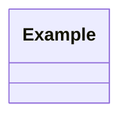
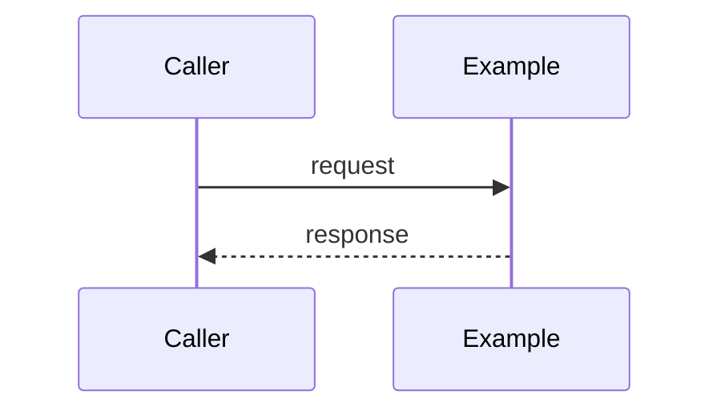

# Plan: {{INITIATIVE}}

<!--
FluencyLoop planning stage — one plan.md per large initiative (an "epic" that will spawn
several feature branches). This is a committed doc on the current branch, not a spec to ratify:
it is the map you build against. Keep the Mermaid blocks TOP-LEVEL (not nested in another code
fence) so GitHub renders them. Delete the example rows and this comment once the plan is real.
-->

started: {{DATE}}

## Goal & scope

- **Goal:** <the outcome this initiative delivers, in one or two lines>
- **In scope:** <what this plan covers>
- **Out of scope / non-goals:** <what it deliberately does not>

## Architecture

<!-- The big shapes at initiative altitude — components/modules and the main flow. Not the
per-feature detail (that belongs in each feature's design.md); the load-bearing structure. -->

## Task breakdown

<!-- Decompose the initiative into task items. Each item is a future `fluencyloop-feature`:
give it a slug-able intent, a rough size, and its dependencies (by id). Order does not matter
here — the roadmap below sequences them. -->

| id | task (feature intent) | size | depends on |
|----|-----------------------|------|------------|
| T1 | <intent>              | S/M/L | —         |
| T2 | <intent>              | S/M/L | T1        |

## Roadmap & critical path

<!-- Group the tasks into milestones/phases in dependency order. The critical path is the
longest chain of dependent tasks — the sequence that sets the earliest finish; call it out so
it gets scheduled first and watched. -->

- **Milestone / phase 1 — <name>:** T1, …
- **Milestone / phase 2 — <name>:** T2, …
- **Critical path:** T1 → T2 → … *(the chain that gates completion)*

## Constitution check

<!-- Any place the architecture rubs against a project principle. Name it plainly; do not
silently "fix" the design to fit. -->

- <principle> — <how this plan honors or tensions it>

## Tickets

<!-- Filled in when GitHub issues + milestone are created for this plan (one issue per task
item, grouped under a milestone). If gh isn't used, the runnable `gh` commands go here instead. -->

- <milestone / issue links, or the gh script to run>
