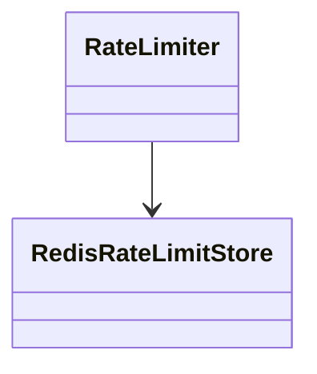
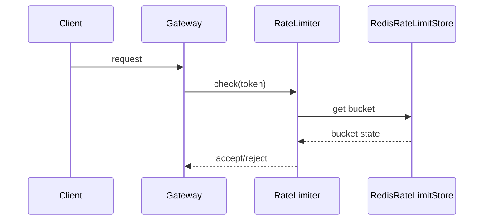

# FluencyLoop

*Keep the people behind a codebase collectively fluent in it, as AI writes more of it.*

---

## The problem

When you write code by hand, comprehension comes for free: you can't build the thing
without holding it in your head. Now the code shows up fully formed, and the *why* behind
it, behind every decision, behind every tradeoff, lives in the model's context for a single turn and
vanishes. We're left with software that works and no one who can say why it's shaped the
way it is.

## The mission

Projects stay maintainable even when most of the code is AI-assisted, because understanding kept pace with generation.

## The name

**FluencyLoop** — the build↔understand rhythm woven into generation. It embodies a practice
we're calling **Fluency-Driven Development (FDD)**: the code and your fluency in it are
produced together, or not at all.

*Fluency*, not comprehension: not just "I understand this" (passive) but "I can read,
reason about, and change it" (active). *Loop*, not Check: it teaches **during**
generation, it is not a quiz **after**.

---

## The workflow

FluencyLoop is a **four-stage workflow**. **Stage 1 is owned by the maintainer and run once
for the whole project.** **Stages 2–4 are driven by the contributor and repeat once per
feature** — whoever sits down to build declares a feature and gets its own design → build →
review cycle, all operating inside the boundaries Stage 1 set once.

```
ONCE, PER PROJECT                 REPEATS, PER FEATURE (contributor-driven)
STAGE 1                           STAGE 2         STAGE 3            STAGE 4
constitution                   →  design       →  build (teach)   →  review
principles                        diagrams         session journal    PR view assembled
(maintainer)                      (this feature)   (this feature)     (this feature)
```

The contributor's entry point is one command:

```
$ fluencyloop feature "adding rate limiting to the gateway"
  → creates features/adding-rate-limiting-to-the-gateway/ (on branch feature/…)
  → prompts for design.md            (Stage 2)
  → build begins, teaching + journaling as it goes   (Stage 3)
  → at PR time the review view assembles itself       (Stage 4)
```

- **Stage 1 — Constitution** *(maintainer, once per project)*. The project's
  non-negotiables, written once and rarely revised. Everything downstream, for every
  feature, is checked against it.
- **Stage 2 — Design** *(contributor, once per feature)*. Before a feature is built,
  produce the diagrams (class, sequence) that make that feature's shape legible — committed
  alongside the feature.
- **Stage 3 — Build (Teach)** *(contributor, per feature)*. As the AI builds the feature, it
  teaches the contributor at each slice boundary and captures each decision to that
  feature's session journal.
- **Stage 4 — Review** *(per feature)*. The PR view assembles itself from the feature whose
  commits landed in it — mapped git-natively, since a feature is a branch.

Nothing here gates a merge. Work that skips the workflow is caught **after** merge by
backfill, not blocked before it (see *Enforcement & backfill*).

---

## Stage 1: Constitution

`docs/fluencyloop/constitution.md` — the project's principles, written (or generated
interactively, in the spirit of SpecKit's `speckit-constitution`) once by the maintainer(s)
and revisited rarely. Unlike SpecKit's constitution, which exists to gate a spec-writing
ritual, FluencyLoop's constitution exists so stages 2–4 — run fresh for every feature —
have something constant to check decisions against:

- Stage 2 diagrams, for any feature, shouldn't model a shape the constitution forbids
  (e.g. *"no synchronous cross-service calls in the request path"*).
- Stage 3 decisions can cite the constitution as part of the *why* (*"token-bucket chosen —
  constitution §2 requires burst tolerance"*).
- Stage 4's assembled PR view can *flag* decisions that were never checked against it — a
  surfaced note, never a block.

Kept deliberately short — a handful of hard constraints and values, not an enterprise
governance document. The *structure* is borrowed from SpecKit; the *size* stays
FluencyLoop-sized (see *Relationship to SpecKit / SDD*).

---

## Stage 2: Design — diagrams scoped to the feature

Triggered by `fluencyloop feature`, before the feature's build work begins, Stage 2 produces
the diagrams that show its shape fastest. The two defaults are a **class diagram** and a
**sequence diagram** — the two that pay their way most often and are first-class Mermaid
types. Other views (an interaction/flow diagram) are optional prose, added only when they
earn it. Unlike the constitution, this is **not project-wide** — it's scoped to the feature
and committed alongside it.

```
.fluencyloop/
  constitution.md
  features/
    adding-rate-limiting-to-the-gateway/
      design.md
```

Example — a feature's `design.md` opens with a `# Design: <feature>` heading, then embeds
its diagrams. On GitHub these render as actual diagrams, not source:

**Class diagram**



**Sequence: incoming request**



Mermaid stays the default rendering choice: no extra tooling, renders natively on GitHub,
plain-text enough for the AI to generate as a byproduct of the design stage. Because
`design.md` is scoped per feature rather than per code area, two different features that
both touch `gateway/` each get their own diagram rather than sharing one that accretes —
a tradeoff named explicitly in *Honest open risks*.

A session's decision entry may optionally point back at its feature's diagram — see the
`design:` field in the *Session file schema* below.

---

## Stage 3 & 4 — Teach and Journal

The original two coupled capabilities, serving two readers at two points in time — now
running once per feature instead of standing alone:

```
                DURING code                     AFTER merge
TEACH  ── keeps the CONTRIBUTOR fluent, now
JOURNAL ─────────────────────────────────────── keeps the REVIEWER (and future
                                                 devs) fluent, later
```

### Stage 3 — Teach: at slice boundaries, calibrated, stays out of the way

Teaching does **not** interrupt mid-thought. The AI builds a meaningful slice — a logical,
commit-worthy chunk — then reviews what it just built, surfaces the **one or two real
decisions** in that slice, and teaches + journals them:

```
agent finishes the rate-limiter slice
  → reviews what it just built
  → surfaces the 1–2 real decisions (token-bucket vs sliding-window; Redis vs in-memory)
  → teaches the why, calibrated to the contributor
  → journals each decision to the session file
```

The teaching itself:

- **Skips what the developer already knows** (calibrated to a per-developer profile).
- **Slows down where they're on unfamiliar ground.**
- **Names, without drama, where knowledge ends and trust begins.**

Slice-boundary review is the deliberate answer to "when does it teach": late enough that the
decision is real and visible in code, early enough to still be *during* the build rather
than a report afterward. It trades a little immediacy for something actually implementable
and predictable — the agent can reliably review a finished slice; it cannot reliably
introspect mid-token.

Tone, non-negotiable:

> *"This is the right call here — here's the one-line why. If A and B feel shaky, that's
> where to dig — but you don't need to right now to trust this."*

Not homework. Not hand-holding. Not a gate. A heads-up that keeps the developer the
author of their own system — fluent on the 90% they own, clear-eyed about the 10% where
they're running on trust.

### Stage 4 — Journal & Review: durable, code-anchored, for whoever reads next

Every meaningful decision is captured to a **shared, committed artifact**, nested under
its feature, at the moment its slice lands. Written not for the author but for the next
reader — a reviewer, a future maintainer, or the AI's next session.

At PR time the **review view assembles itself**: because a feature is a branch, the tool
gathers the feature(s) whose commits are in the PR and renders their sessions as a
reviewer-facing summary. The contributor links nothing by hand.

The real-time teaching is what makes the journal *truthful*: a contributor can't journal a
"why" they never engaged with, and the reviewer who reads it is the honesty-forcing
function that keeps it from becoming plausible-sounding after-the-fact fiction.

### Enforcement & backfill

**FluencyLoop never gates.** It does not block a merge, fail CI, or require a journal to
ship — consistent with the standing principle *flag exposure, don't gate*. "Instituted for
the whole project" means the constitution and the workflow are *available and encouraged*
project-wide, not enforced.

The safety net for work that shipped without going through the loop is **post-merge
backfill**, not a pre-merge gate:

```
$ fluencyloop backfill <PR>
  → reads the merged diff + commit history
  → drafts a session with decision blocks for the undocumented work
  → marks EVERY backfilled entry  trust: ⚠ unverified
  → a human reviews and edits before it is committed
```

Backfill is the escape hatch that lets the ideal path (`feature → design → build`) stay the
*ideal* without being *mandatory*: ad-hoc work gets a home retroactively instead of being
forced through ceremony up front, or blocked. Its honesty cost is real and is called out in
*Honest open risks* — a backfilled `why` had no real-time teaching to force engagement, so
it is the entry most at risk of plausible post-hoc narration. That is exactly why every
backfilled entry is stamped `trust: ⚠ unverified` and must pass a human before it lands.

---

## Who it's for

Two roles, one loop:

```
MAINTAINER    → owns Stage 1 only: writes the constitution once, rarely revises it.
                Sets the boundaries; does not micromanage features.
CONTRIBUTOR   → the active driver of Stages 2–4: declares a feature, gets the design
(the wedge)     diagrams, is taught through the build, and journals as a byproduct.
                Still gets the original payoff — faster merge, less back-and-forth,
                a PR that reads like they did the work, because in the fluency sense
                they did.
```

This is **additive, not a flip**. An earlier framing worried that adding a maintainer-owned
artifact would turn the tool "adversarial, needs a top-down mandate, adoption blocked on
buy-in." But the constitution is the *only* thing the maintainer owns, and it is written
once; everything a contributor actually experiences — declaring a feature, being taught,
journaling — stays bottom-up and contributor-driven. FluencyLoop adds a project-level
constitution *on top of* the original contributor loop; it does not replace the contributor
as the center of gravity. The adoption risk this still carries is tracked honestly in
*Honest open risks*, not buried.

---

## Core design decisions (settled)

### Anchor: the project (stage 1), the feature (stages 2–4)

- **Stage 1 is project-scoped** — the constitution is written once by the maintainer,
  applies everywhere, revisited rarely.
- **Stages 2–4 are feature-scoped, and the contributor declares the feature** — at build
  time, via `fluencyloop feature "<intent>"`, which creates the feature dir and branch. This
  directly reverses an earlier decision in this project's history ("not features — feature
  dirs only exist because SpecKit's ceremony created them; our audience has none"). That
  reasoning assumed features could only come from a maintainer's up-front planning ceremony.
  They don't here: the *contributor* names a feature in one line at the moment they start
  building, the same zero-ceremony breath in which they'd have declared a session. The
  feature is just the unit that owns the diagrams and groups the sessions.
- **The session is the atom inside a feature.** A feature decomposes into one or more
  sessions — units of intent, each a slice of the build (*"wiring the Redis store"*).
  Sessions survive refactoring because they're tied to intent, not file/line positions.
  They nest one level under the feature that owns them.

```
.fluencyloop/
  constitution.md                              ← STAGE 1, project-level, once

  features/
    adding-rate-limiting-to-the-gateway/       ← = the branch feature/adding-rate-limiting…
      design.md                                ← STAGE 2, this feature's diagrams
      sessions/
        rate-limiter-core.md                   ← STAGE 3, per-decision journal
        redis-store-wiring.md
```

The filenames alone are still a comprehension map — a human scanning `features/` sees
every feature the project's ever built; scanning one feature's `sessions/` sees every
intent inside it.

### PR is a *view assembled from* a feature (via its branch), not an anchor

A **feature is a branch** (`feature/<slug>`), so the PR view assembles itself from the
branch with no manual linking: gather the feature(s) whose commits are in the PR, render
their sessions. Commits are *derived live* from the branch at the feature level — the
schema stores no SHAs (that resolves the old "store vs. derive" open question).

The relationships, stated precisely:

```
session → feature   1:N   (nesting; a session lives under exactly one feature dir)
feature ↔ PR         usually 1:1 (one feature branch = one PR), may be 1:N if a
                     feature's branch is merged across several PRs
```

Capture is anchored to the **session** (truthful, in-the-moment as each slice lands),
grouped under its **feature** (which owns the design diagrams and the branch). There is no
session-level commit tracking: feature-level assembly by branch is enough, and each
decision's `where:` field already anchors it to code.

```
CAPTURE   → decisions journal to SESSIONS, nested under their FEATURE
ASSEMBLE  → at PR time, gather the feature(s) whose branch commits are in this PR,
            render their sessions as a summary
```

### Output format: (c) — both

- **Committed `docs/fluencyloop/features/<feature>/sessions/<name>.md`** — the durable project
  artifact; permanent project memory; how a new contributor gets fluent fast.
  Version-controlled, in-repo.
- **Generated PR-description summary** — the reviewer-facing view, assembled from the
  feature the PR contains. Native to review, friction-free.

Three granularities, same data: session is the atom, feature is the molecule (owns the
design diagrams, the branch, and the sessions that built it), PR is the assembled view.

### Session file schema

What actually goes inside a `docs/fluencyloop/features/<feature>/sessions/<name>.md` — a header
plus one block per decision. Human-readable first, script-parseable second.

```markdown
# Session: wiring the Redis rate-limit store

- **intent:** protect the gateway from bursty clients without hurting p99
- **started:** 2026-07-10

---

## Decision: token-bucket over sliding-window

- **where:** `gateway/RateLimiter.java`
- **why:** burst tolerance matters here — clients spike legitimately at minute
  boundaries; token-bucket absorbs that, sliding-window rejects it
- **alternative:** sliding-window log — rejected: smoother but no burst headroom
- **design:** ../design.md#sequence-incoming-request
- **constitution:** §2 (services must tolerate legitimate burst traffic)
- **trust:** ⚠ algorithm choice not independently verified

## Decision: rate-limit state in Redis, not in-memory

- **where:** `gateway/RedisRateLimitStore.java`
- **why:** the gateway runs multi-instance; in-memory state would let a client
  exceed the limit by hitting different instances
- **alternative:** in-memory Map — rejected: correct only for single-instance
- **trust:** ✓ verified — multi-instance failure mode understood
```

Each field is a **bullet** — so it renders one-per-line as real Markdown. Plain
`key: value` lines look fine in a raw view but collapse into a single paragraph once
rendered, which is why the schema uses list items.

Why each field exists:

- **`where:`** — the code anchor. Satisfies the "anchor every claim to a code location"
  honesty mitigation. Deliberately a **file/area, not a line number**, so it survives
  refactoring (dodges the drift problem).
- **`why:`** — the rationale, taught in real time at the slice boundary before it's written.
- **`alternative:`** — the rejected option and why. This is what makes an entry
  *rationale* rather than description: "chose X" is useless; "chose X over Y because Z"
  is comprehension.
- **`design:`** *(optional)* — points at the Stage 2 diagram (within this same feature)
  that this decision affected or drew on. Not required for every entry: only decisions
  that shape or depend on the feature's structure need it.
- **`constitution:`** *(optional)* — points at the Stage 1 principle this decision serves
  or trades off against. Gives reviewers a fast way to see which decisions are
  constitution-driven versus purely local.
- **`trust:`** — the ✓/⚠ marker makes durable the teaching's "where knowledge ends and
  trust begins" line. **It describes the DECISION's verification state, never the
  author's competence** (decision A). "This choice wasn't independently verified" is a
  fact about the work; "the author is a novice" is a judgment about a person — the schema
  is barred from the latter (GDPR rule 4). Same value to a reviewer, cleaner posture.
  **Every backfilled entry is stamped `⚠ unverified` by default** (see *Enforcement &
  backfill*).

There is deliberately **no `commits:` header**: the feature is a branch, so the PR view
derives its commits live from git at assembly time rather than storing SHAs that a
rebase/squash would leave stale.

The session-declaration step inside a feature stays zero-ceremony: the developer names a
slice in one breath and starts building — the journal accretes as a byproduct. Stage 1 is
the one-time ceremony the maintainer sets up for the whole project; Stage 2's per-feature
design is set up once per feature by the contributor who declared it.

### Calibration is the load-bearing artifact

A persistent per-developer profile (e.g. *"senior Java, reactive is new, dislikes
hand-holding on basics"*) drives the **teaching** — skip the known, teach the new. It lives
in a **global user dir** (portable across projects, machine-local, private) and is
**dimensioned by domain/language** rather than flat — see *Developer profile & GDPR*. The
**journal**, by contrast, is calibrated to nobody: it's written for whoever reads next.

**Cold-start:** on first-ever run the profile is empty. FluencyLoop seeds it by inferring
from the dev's git history (languages, longevity, commit patterns) plus a couple of
first-run questions, then refines it as it teaches. It never blocks on a filled-in profile —
an empty profile just means it teaches a little more until it learns what to skip.

**Authorship is not fluency.** Calibration skips on *domain* knowledge, never on *authorship*.
That a developer committed a file — especially AI-generated code they vibecoded — does not
mean they can reason about it; it is often where they are *least* fluent, because they
supplied the intent and the model supplied the decisions. Skipping teaching because "they
wrote it" is precisely the erosion this whole project exists to catch. This is the same
insight the knowledge map (B) formalizes: fluency is authorship *∩ having been taught through
the code*, not authorship alone.

---

## Relationship to SpecKit / SDD

FluencyLoop now borrows more of SpecKit's shape than the original version of this project
assumed. The maintainer-owned constitution plus the per-feature scoping of stages 2–4 put
this closer to SpecKit's feature-directory model than the original doc argued for. What's
still different:

```
STEAL:  constitution.md as a project-level committed artifact (stage 1)
        per-feature scoping for design/build/review (stages 2–4) — the same unit
          SpecKit's feature directories use, but declared by the CONTRIBUTOR at build
          time, not by an up-front planning ceremony
        a pre-build design phase (stage 2) — but diagram-first (class + sequence),
          not spec.md + plan.md + tasks.md prose
        the three-layer architecture: skill / scripts / state

UNIQUE  slice-boundary teach-in-the-loop during build (stage 3) — SpecKit has none
(no       fluency journal + PR-view assembly after merge (stage 4) — SpecKit stops
 SpecKit    at implementation, has no post-merge comprehension artifact
equiv.)   post-merge backfill — reconstruct-and-flag gaps instead of gating them
        per-developer calibration profile (GDPR-scoped, global, domain-dimensioned)
        derived, ephemeral knowledge map (never a stored competence dossier)

LEAVE:  SpecKit's finer-grained ritual — separate spec.md / tasks.md, the
        /clarify Q&A loop, the /analyze consistency pass, and all gating. Stage 2
        stays diagram-first and lighter; the constitution stays short; nothing blocks.
```

```
              BEFORE code                     DURING code            AFTER merge
SDD/SpecKit   constitution→spec→plan→tasks  ─────────────────────────────────────
FluencyLoop   constitution→design(diagrams)   teach (fluency now) ── journal→review→backfill
              (project)      (per feature)     (per feature)         (per feature)
```

**Honest tension.** The earlier version of this doc rejected SpecKit's ceremony outright as
the wrong fit for "vibe-coders and OSS maintainers who reached for AI to avoid ceremony,"
and separately rejected feature directories by name as the wrong unit. Both calls are
softened now: a short constitution and a diagram-first design stage *are* light ceremony,
and the feature *is* the unit — but the contributor declares it in one line at build time,
and nothing is gated. The bet is that this is cheap enough to not repel that audience while
unlocking whole-project value — a shared mental model, not just per-PR fluency — that the
pure bottom-up wedge could never produce. This is unproven; it's tracked in *Honest open
risks*, not resolved by assertion.

---

## Developer profile & GDPR

The "developer profile" is really **two different things** with very different risk
profiles. Conflating them is a legal and ethical hazard; the design keeps them separate.

```
A. SKILL CALIBRATION      "senior Java, reactive is new, dislikes hand-holding"
                          → about the person's ABILITY. Self-reported, subjective.
                          → drives TEACHING (skip the known, teach the new).

B. KNOWLEDGE MAP          "dev A authored the sessions on the rate-limiter and token
                            refresh → is fluent in those areas"
                          → DERIVED from git facts (who authored what) ∩ sessions.
                          → drives "who to ask", onboarding, review routing,
                            bus-factor detection.
```

B is more powerful than A because it's **derivable, not self-reported** — you observe
"they built X and were taught through it," rather than asking "are you good at X?" It is
the collective-fluency mission made concrete: the project knows who understands what.

**But B is squarely personal data, and evaluative personal data is the sensitive kind.**
GDPR applies the moment we store "dev A knows X, is weak on Y." The specific hazards:

- A competence judgment ("weak on concurrency") is data a person has rights over and
  could be *harmed* by (performance review, hiring, blame).
- If committed to git, it is **permanent and potentially public** — and **git's immutable
  history is antithetical to the right to erasure.** You cannot truly delete it later.
- Consent: a contributor never agreed to a published competence dossier about themselves.

### The principle that keeps the power and defuses the risk

**Store objective facts about the work; derive judgments about people on the fly; never
persist an evaluative record tied to a named individual.**

```
PERSIST (safe)     the SESSION — what it was about, what decisions, what code.
                   Authorship comes from GIT (already there, already consented-to by
                   the act of committing). Store NOTHING extra about people.

DERIVE (ephemeral) "who's fluent in the rate-limiter?" — computed at query time from
                   git authorship ∩ sessions. A live LENS, not a stored FILE. Nothing
                   to leak, nothing to erase.

SEPARATE the two profile halves — they have different SCOPES, not just risk levels:
  - Skill calibration (A) → about the DEVELOPER, portable across all their projects.
    Lives in a GLOBAL user dir (~/.fluencyloop/, or ~/.claude/ while Claude-hosted),
    machine-local, user-owned, never committed, never transmitted. The dev's own
    tuning of their own teaching — their data, on their box, theirs to edit/delete.
  - Knowledge map (B)     → about WHO-KNOWS-WHAT in a SPECIFIC project; inherently
    project-scoped and multi-person. NOT a stored artifact anywhere — LOCAL OR GLOBAL.
    A derived view over (that project's sessions) ∩ (git authorship), generated on
    demand. Never a persisted competence dossier.
```

**Why A is global (not per-project).** The profile is about the person, not the repo.
Storing it per-project re-learns the same facts in every repo and repeats the cold-start
problem everywhere. Global storage learns the dev *once* and amortizes across every
project — by their third repo, FluencyLoop already knows them. It is also the cleanest
GDPR posture: the person's own data, on their own machine, under their own control
(data minimization; the data subject holds their own data).

**A must be dimensioned by domain/language, not flat.** A global "this dev is senior"
would wrongly silence teaching in a domain where they're a beginner. The profile is global
in *location* but dimensioned in *content*:

```
~/.fluencyloop/calibration.md
  Java / backend     → senior, minimal narration
  reactive streams   → learning, teach the tradeoffs
  Rust               → beginner, slow down
  frontend / CSS     → novice, explain freely
```

**Why B is explicitly NOT in the global dir either.** A knowledge map of "who understands
the payments module" is data about *other contributors*. Putting it in *your* personal
`~/.fluencyloop/` means holding evaluative data about other people, un-audited, outside any
project governance, on individual laptops — the GDPR hazard relocated to a *worse* place.
B is only coherent *within* a project (that project's authorship ∩ its sessions), so it is
derived on demand and stored nowhere — not locally, not globally.

**Namespace note:** the calibration profile is conceptually tool-agnostic (about the dev,
not about Claude). Preferring a neutral `~/.fluencyloop/` over `~/.claude/` keeps the door
open to other coding agents (Cursor, Copilot) reading the same profile later, without a
migration.

### Concrete GDPR-safe rules (binding on the design)

1. **Skill-calibration profile is LOCAL ONLY** — `.gitignored`, on the dev's machine,
   never leaves their control. (Data minimization.)
2. **No committed competence judgments about named individuals. Ever.**
3. **The knowledge map is derived, not stored** — `(committed sessions) ∩ (git
   authorship)`, computed at query time, ephemeral.
4. **Sessions describe THE WORK, not THE PERSON** — "the rate-limiter uses token-bucket
   because…", never "dev A is weak on X." Attribution comes free from git. This extends
   to the `trust:` marker (see *Session file schema*): it records a decision's
   *verification state* ("not independently verified"), never an author's competence.
5. **Any future team-level aggregation** (if a maintainer ever asks): pseudonymize,
   make it opt-in, and keep it OUT of committed git history (git can't honor erasure).

### The honest tension

The *most useful* B is a persisted, team-visible "who knows what" map (onboarding, review
routing, bus-factor). The *most GDPR-safe* B is ephemeral and derived. You cannot fully
have both. **Decision: ship the derived/ephemeral version first** — all the "who to ask"
utility, none of the dossier risk. A persisted team-competence map is a separate, opt-in,
carefully-governed *maybe-later*, built only if someone actually needs it (evidence-first).

---

## Architecture (four layers, three from SpecKit's engineering)

```
skill(s)          Stage 1: constitution authoring (interactive, speckit-constitution-style)
                           — run once per project by the maintainer
                  Stage 2: design — generate a feature's class + sequence diagrams
                           — triggered by `fluencyloop feature`
                  Stage 3: slice-boundary teach in real-time (calibrated to the contributor);
                           supply the journal content the scripts then persist
                  Stage 4: assemble the PR view; `fluencyloop backfill` — reconstruct-and-flag
                           gaps on a merged PR (always trust: ⚠, human-reviewed)

scripts           deterministic (so the journal is reliable, not left to the LLM):
                  declare a feature (dir + branch), open/append sessions, WRITE journal
                  entries the skill supplies, resolve feature↔branch, assemble the PR view
                  by branch, run backfill's diff→draft, git operations

state             PROJECT state (.fluencyloop/, in-repo):
                    constitution.md                   → Stage 1, project-level, ONCE
                    features/<feature>/design.md      → Stage 2, this feature's diagrams
                    features/<feature>/sessions/<name>.md
                                                       → Stage 3, durable, COMMITTED
                                                         per-decision journal (no commits:
                                                         header — feature = branch = dir)
                  GLOBAL state (~/.fluencyloop/, machine-local, per-dev):
                    calibration.md (A)                → domain-dimensioned, private,
                                                         portable, never committed
                  DERIVED, stored NOWHERE:
                    knowledge map (B)                 → computed at query time from a
                                                         project's sessions ∩ git authorship

command surface   fluencyloop feature "<intent>"   → Stage 2–3 entry (dir + branch + design)
                  fluencyloop backfill <PR>         → post-merge gap reconstruction
                  (constitution authoring for Stage 1; PR-view assembly runs at review time)
```

See **Developer profile & GDPR** for why calibration (A) lives in a global user dir and
the knowledge map (B) is derived rather than persisted anywhere.

---

## Honest open risks (carry forward, don't bury)

1. **Adoption still needs a maintainer to seed the constitution.** Even though the
   contributor drives Stages 2–4, Stage 1 is maintainer-owned — so a project only gets the
   whole-project payoff once someone writes the constitution. The contributor loop works
   without it (features, teaching, journaling all run), but the "shared mental model"
   mission leans on a maintainer doing the one-time setup. Whether that setup is worth it is
   unproven.
2. **Ceremony creep.** A constitution and a per-feature design stage are light ceremony this
   project's earlier version rejected outright for this audience. Mitigation: constitution
   stays short, design stays diagram-first, the feature is declared in one line, and nothing
   gates — but there's no evidence yet that this is light enough to avoid repelling the
   "avoid ceremony" audience the project started from.
3. **Per-feature design docs can duplicate or drift from each other.** Because `design.md`
   is scoped to the feature rather than a persistent code area, two features that both touch
   the same code (e.g. `gateway/`) each get their own diagram instead of sharing one that
   accretes — risking contradictory diagrams for the same code over time. No cross-feature
   reconciliation exists yet, and **diagram staleness detection is out of scope for v1**
   (diagrams are honor-system-maintained); both are named limitations, not solved problems.
4. **Rationale honesty — and backfill is the sharp edge of it.** The journaled "why" can
   become plausible post-hoc narration. For live entries this is mitigated by slice-boundary
   teaching (forces engagement), the `where:` code anchor, the named `alternative:`, and the
   reviewer as BS-detector. **Backfilled entries have none of that real-time engagement** —
   they are reconstructed from a diff after the fact, so they are the single highest-risk
   entries for fiction. Mitigation: every backfilled entry is stamped `trust: ⚠ unverified`
   and cannot land without human review.
5. **Platform risk.** The good version is close to a feature of the coding agent itself
   (Claude Code / Cursor). We build *on* that surface; a platform could absorb the idea.
   Counter: a working skill today costs almost nothing to try and dogfood.
6. **Work that skipped the loop.** Ad-hoc changes with no declared feature are handled by
   post-merge `fluencyloop backfill`, which gives them a feature + session retroactively — there
   is deliberately no `features/unfiled/` bucket. The residual risk is that backfill is
   opt-in effort after the fact, so undocumented work stays undocumented until someone runs
   it.
7. **The speed/understanding tradeoff is real and does not disappear.** The tool's job is
   not to erase it but to let the developer choose per moment and make whichever choice
   efficient for *them*. Any pitch claiming zero-cost comprehension is dishonest.
8. **GDPR / personal data.** The knowledge map is derived personal data; a persisted
   competence profile tied to a named person collides with the right to erasure (git is
   immutable). Mitigated by the persist-facts / derive-judgments split (see *Developer
   profile & GDPR*) — but any future team-aggregation feature must be revisited legally.

---

## Validation plan (evidence over pitch)

Consistent with how weaker ideas were killed before (LLM router, bandit, guardrails) and
how mnemo-cache was built (small real thing, dogfooded):

1. **Build the skills in parallel** — SpecKit's `speckit-constitution` is the structural
   template for stage 1; `speckit-plan` for stage 2's per-feature design; `speckit-clarify`'s
   interactive one-at-a-time loop remains the template for stage 3's capture flow. Ship the
   `fluencyloop feature` and `fluencyloop backfill` command surface first.
2. **Dogfood** on a real project (blastradius, or the next mnemo feature) for a week:
   institute the constitution once, then run `fluencyloop feature → design → build` on a couple
   of real features, and try `fluencyloop backfill` on a PR that skipped the loop. Does staying
   fluent *feel* different from generic narration, and does the per-feature setup cost feel
   worth it? That's the whole hypothesis, tested for the cost of a skill file.

---

## Status

Refined (2026-07-10) into a concrete, buildable shape. Stage 1 (constitution) is
maintainer-owned and project-level, once; Stages 2–4 (design, build, review) are
**contributor-driven per feature**, declared at build time via `fluencyloop feature`. A feature
is a branch, so the PR view assembles itself and session files carry no commit SHAs.
Teaching fires at **slice boundaries**. Nothing gates — post-merge `fluencyloop backfill`
reconstructs-and-flags gaps instead. The framing is **additive** (a project constitution on
top of the original contributor loop), not a flip away from the contributor wedge.

Essay drafted (pre-refinement; needs a pass reflecting the additive framing before
publishing). No skill built yet. Next concrete steps:

- The `docs/fluencyloop/constitution.md` template (stage 1, maintainer, project-level).
- The `docs/fluencyloop/features/<feature>/design.md` schema — class + sequence by default; how
  `fluencyloop feature` scaffolds the dir + branch (stage 2).
- The `docs/fluencyloop/features/<feature>/sessions/<name>.md` schema — as refined above (no
  `commits:` header; optional `design:` and `constitution:` fields), plus the
  slice-boundary capture flow (stage 3) and branch-based PR-view assembly (stage 4).
- The `fluencyloop feature` and `fluencyloop backfill` commands (scripts layer).

## Standing principles

- **Stay out of the way** — never block the fast path; flag exposure, don't gate.
- **The developer stays the architect** — the tool serves their authorship, not the reverse.
- **Honest about tradeoffs** — no claim of free comprehension.
