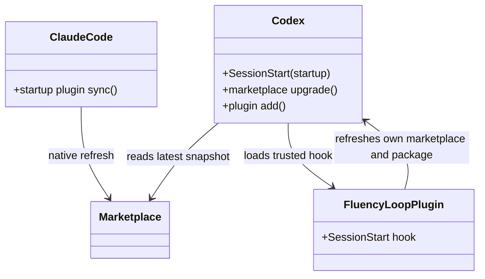
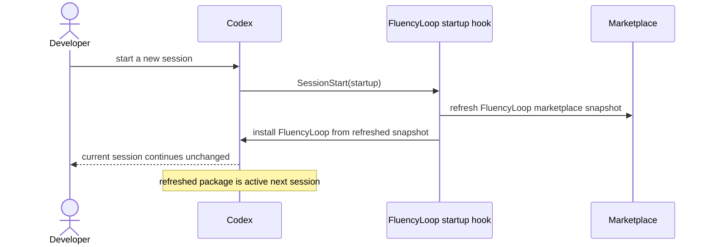

## Refresh FluencyLoop marketplace packages automatically when an agent starts

**Date:** 2026-07-15

## Intent

Make marketplace-installed FluencyLoop packages check for updates whenever a developer starts
Claude Code or Codex, without bringing back a global installer.

## Design

Claude Code already refreshes enabled marketplace plugins during normal startup. FluencyLoop uses
that native lifecycle and documents the one host setting that can disable it.

Codex exposes no built-in marketplace refresh-on-start option, but it does load trusted plugin
`SessionStart` hooks. The FluencyLoop plugin ships a small cross-platform hook. It derives the
marketplace that supplied the currently running FluencyLoop package from Codex's cache path,
refreshes only that marketplace, then asks Codex to install the current FluencyLoop package from
the refreshed snapshot. A version installed during startup is used by the next session, never by
the session already running.

## Constitution check

- **§1:** Claude uses its native updater; Codex uses its supported plugin-hook lifecycle.
- **§2:** Codex updates only for the following session.
- **§3:** The hook derives and refreshes only FluencyLoop's supplying marketplace.
