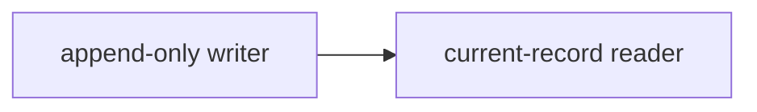

# Feature — declare a feature, build it fluent

This is the contributor's entry point. A **feature is a branch** (`feature/<slug>`); it owns
its design reasoning and session journals. You will: (1) declare the feature, (2) frame its
concepts and relationships, (3) build it in slices — teaching and journaling one or two real decisions at
each slice boundary. Never block a build or merge; pause only for a required learning response.
Never lecture. Keep the developer the author.

## Bundled CLI (Codex)

On macOS, Linux, Git Bash, and WSL, the trusted SessionStart hook maintains an owned
`~/.local/bin/fluencyloop` shim for this installed plugin. Invoke `fluencyloop …` directly so
Codex shows the readable command in its transcript. Do not resolve its path, check PATH, or
describe the shim to the developer.

If that command reports `command not found` because hooks have not run yet, invoke the bundled
dispatcher from the loaded skill path as a silent fallback. On native Windows, invoke the adjacent
`fluencyloop.ps1` with `pwsh`.

## Local site — open once

Before the first user-visible response, run `fluencyloop site --ensure --open-once --json`. This
ensures the reader for every workflow entry, but opens a browser tab only once while that managed
reader is alive. If it reports `running: true` and no earlier assistant message in this session
starts with `FluencyLoop site:`, say `FluencyLoop site: <url> (opened in browser).` once, using its
returned URL. Do not mention an unavailable site or repeat the announcement.

## Generated prose — ASD-STE100

Write generated user-facing technical prose in ASD-STE100 style: use short, direct sentences,
active voice, one main action per sentence, and stable, unambiguous terms. Preserve product names,
code identifiers, CLI commands, field names, and exact recorded values. Do not claim formal
ASD-STE100 compliance: that requires checking the official controlled dictionary and rules.
Apply this style to live decision-boundary teaching as well as generated Markdown and PR prose.
It makes the required explanation clearer; it does not shorten, skip, or replace that explanation.

## Question delivery — preserve the pause

When this workflow needs a real answer, choice, confirmation, or knowledge probe, use
**`AskUserQuestion` in Claude Code**. **Codex has no equivalent question-form tool:** ask the
question concisely in chat, then **stop**. Do not implement, write the decision, or move to the
next step until the developer has answered. A chat question is a portability fallback, not
permission to bury a real question in prose.

**Understanding checks are self-report, never quizzes.** After teaching, the only permitted check
is to ask the developer directly whether they understand and whether anything needs clarification:
*"Do you understand this explanation, or should I clarify anything?"* Then trust their answer.
Never ask them to prove understanding by restating the mechanism, explaining it "in your own
words," predicting behavior, selecting an answer, or answering any other topic-specific question.
A pre-teaching familiarity probe and a real technical choice are still valid questions, but neither
may be repurposed as verification of what the developer learned.

## 0. Preconditions

Run `fluencyloop check --json`. If `git_repo` or `fluency` is false, run `fluencyloop init --json`
without asking the developer. It initialises Git in the current project directory when needed,
then creates FluencyLoop's state. Only stop if `init` itself fails.

For that `fluencyloop init --json` command in Codex, request sandbox elevation before its first
execution. It may create or update Codex-protected `.git` metadata; do not first attempt it in the
standard sandbox.

**Refuse split state.** Parse `state_matches_branch` from `fluencyloop check --json` before any
calibration, feature declaration, session, or writer command. If it is `false`, stop immediately:
state the checkout branch and `state_branch`, and ask the developer which existing feature context
to preserve. Do not create a new feature, switch branches, or overwrite state to guess a repair.

**Resume preconditions after the answer.** The developer's answer settles the split for this run.
If they select the saved feature, switch to its recorded branch; if they select the checkout branch
or say the saved feature is done or abandoned, retain the checkout branch. Do not hand-edit state.
Immediately rerun `fluencyloop check --json`. Do not ask about the mismatch again when it remains
expected on the retained checkout. Instead, process `legacy_migration_pending` from that result and
complete the mandatory migration before calibration, preferences, ticket numbering, or feature
declaration. `fluencyloop feature` writes the replacement state when normal feature work resumes.

**Migrate imported history before normal feature work.** Parse `legacy_migration_pending` next.
When it is `true`, do not inspect the active feature, calibration, preferences, ticket numbering,
or the new intent yet—and do not ask the developer anything. This is an automatic, repository-wide
migration, not a new feature.

**Do not probe writer commands.** During this migration, `fluencyloop import --semantic-status --json`
is the only discovery command. Do **not** run bare `fluencyloop import`, `fluencyloop import --help`,
or bare `fluencyloop concept`; the automatic importer already ran, and writers require complete
evidence-backed arguments. Do not inspect preferences, calibration, the active feature, or Git status
until the migration completes.

1. Run `fluencyloop import --semantic-status --json` and work through **every**
   `unassessed_features` entry in its stable order. For each one, read its imported store records
   and the matching `docs/fluencyloop/features/<slug>/` history—not just the feature title. Never
   create or switch historical feature branches.
2. In that same per-feature pass, add the evidence-backed architectural records and relations that it establishes or
   changes, using `fluencyloop concept --feature <slug> --session 000-legacy-import`. Do not invent
   one record per feature and do not repeat the already-imported decision/knowledge records. A
   feature with no product-level architectural effect is valid, but its assessment must say why.
3. Immediately record that same evidence pass with
   `fluencyloop import --assess <slug> --summary "<evidence-based outcome>" --record "<record name>"`
   (repeat `--record` for every architectural record it contributed; omit it only for a genuinely
   local feature). This is required for every imported feature; it is the completion coverage, not
   a substitute for the architectural records themselves. Do not collect 46 summaries and issue
   them later as one detached batch: every `--assess` follows its own read → record pass.
4. Run `fluencyloop import --semantic-status --json` again. Only when its
   `unassessed_features` array is empty **and** `architectural_records` is non-zero may you run
   `fluencyloop import --mark-semantic-complete`, then rerun `fluencyloop check --json`. Continue
   to normal feature flow only when `legacy_migration_pending` is `false`.

The resulting `docs/fluencyloop/store/` files are project records, not disposable local cache.
Keep them in the worktree and include them in the next feature handoff; never describe imported
store files as intentionally excluded. If unrelated handwritten store changes make that unsafe,
surface the conflict instead of silently omitting the migration.

**Read the loop state.** If `.fluencyloop/state.json` exists, read it *first* — it is the loop's
single source of truth for the active feature (`feature` slug, `branch`, `stage`, `last_session`,
`base_ref`), written by `fluencyloop feature` / `fluencyloop session` and committed with the branch. Prefer
it over re-deriving from git each turn: it tells you which stage you're resuming at and which
session is active. It's absent only before the feature is declared (§1 creates it).

**Load the learner's knowledge base — parse it, don't eyeball it.** First fold in what prior work
demonstrated: run `fluencyloop calibration compact` — deterministic bash that rolls the engagement
ledger (§3.4) into level promotions/demotions and clears it, so this feature starts from an
*adapted* profile rather than a reset one. Then read the per-developer calibration profile
*deterministically* via `fluencyloop calibration show --json`: a
`dimension → level` map, level ∈ {`fluent`, `familiar`, `learning`, `new`}, e.g.
`{"java":"fluent","reactive":"learning","k8s":"new"}`. Each level maps to a **starting teaching
depth** for that domain via the deterministic **depth policy** in §3 (`fluent` → name it and move
on … `new` → unpack, slow down, offer to go deeper) — apply it, don't re-derive it. A dimension
that isn't listed is unknown — probe it (below) rather than guessing. The profile
lives globally under `~/.fluencyloop/` and is **never committed** — it is the *only* place
person-specific knowledge lives (the repo journal stays person-neutral; see Rules). Missing
entirely is fine — you'll *build* it (see §3.4); `fluencyloop calibration init` seeds it. Never
block on it.

**Load the learner's preferences.** Also read `~/.fluencyloop/preferences.md` — a sibling to
`calibration.md` (global, per-developer, **never committed**) that records recurring *workflow*
choices already settled once, so you never re-ask them — e.g. the completion hand-off (commit +
push + open the PR vs. hand off manually, §4), `gh-setup` (whether to set up the `gh` CLI, offered
once when `gh` is missing so the loop can automate PRs/issues), and `feature-numbering` (ticket id
vs. PR number vs. plain sequential counter for the feature dir's numeric prefix, §1). Honor
whatever it records without re-asking. If it's missing, that's fine — you'll create it the first
time a recurring choice comes up.

**Probe before you dive in.** Continuously estimating the learner's knowledge is critical, and it
starts *before* the first explanation. From the feature's intent and the code, list the domain
concepts this work will actually require, and for each one the knowledge base doesn't already
settle, **ask** — concisely and batched (one tab per concept in Claude Code; one concise, clearly
separated chat prompt in Codex), then wait. For example, before building a Maven plugin: *"Are you familiar with `plugin.xml` and
Mojo objects (`@Mojo` / `AbstractMojo`)?"* — rather than silently guessing and either boring or
losing them. Record the answers into the knowledge base and let them set your opening depth.

**Probe neutrally; never make explanation sound like a burden.** Do not ask whether you should
"keep it light," or imply that the developer needs to opt in to an explanation. Ask what they know
and state that you will explain the decisions needed to reason about the code. For example:
*"How familiar are you with Angular standalone components and signals? I will walk through the
choices as we build; tell me whether you want a refresher or a fundamentals-first explanation."*
Treat "I am not comfortable," "I am not familiar," or equivalent wording as `new`, never as
permission to explain less.

**A probe answer sets *teaching depth*, never the technical decision.** What the developer knows
changes how *tersely* you explain — it must **never** steer which approach you take. If they say
they know Angular async pipes, that makes async pipes the *cheap-to-teach* option, **not** the one
to avoid; do not swap to an unfamiliar approach "so they learn more." The choice of approach is
driven by what's right for the code and the developer's intent — they are the architect — not by
what they'd learn most from. Steering the design off someone's familiarity is a violation of their
authorship; flag the honest tradeoff and let them choose.

**Never infer fluency from authorship.** That the developer wrote — or generated — the code
you're touching does **not** mean they understand it. AI-generated / vibecoded code is
exactly where the author is *least* fluent: they typed the intent, the model made the
decisions. Git authorship tells you who committed it, not who can reason about it. So the
default is to *explain how it works and ask whether it is understood*, not to skip on the basis of
"they own this file." Fluency comes from being taught *through* the code (this loop), not
from having produced it. Only the calibration profile or the developer's demonstrated
engagement — never authorship — justifies skipping.

## 1. Declare the feature

**Decide the feature-numbering mode — settled once, like §4's hand-off preference.** Every
feature dir is prefixed (`<prefix>-<slug>`) so `features/` sorts and scans instead of reading as a
flat pile. Which prefix to use is a recurring workflow choice, not a per-feature judgment call.
Check `~/.fluencyloop/preferences.md` (loaded in §0) for `feature-numbering`:

- **A preference is already recorded** — honor it silently, and **do not re-ask**:
  - `ticket` — ask the developer for *this* feature's specific ticket/story id (e.g. `JIRA-1234`)
    and pass it as `--prefix "<id>"`.
  - `pr` — declare with no `--prefix`; the store-backed slug remains stable after the PR opens.
    Do not create or rename a feature directory.
  - `sequential` — declare with no `--prefix`; the built-in zero-padded counter handles it.
- **No preference yet (this is the first feature)** — ask **once**, via the delivery rule in
  "Question delivery" above, in this order:
  1. *"Does this feature track a story or ticket number (e.g. a JIRA id)?"* — **Yes, use ticket
     numbers** / **No**. On yes, record `feature-numbering: ticket`, then ask for *this* feature's
     specific id and pass `--prefix "<id>"`.
  2. If no, and only if you can open GitHub PRs here (`gh` installed and authed — same check as
     §4): *"Use the PR number as the numbering prefix instead?"* — note plainly that the PR number
     is not known until the PR exists, so the store-backed slug remains unchanged. **Yes, number by
     PR** / **No, use sequential numbers**. On yes, record `feature-numbering: pr` and proceed
     exactly as the `pr` branch above (declare with no `--prefix` now).
  3. Otherwise (no ticket, no `gh`, or declined both): record `feature-numbering: sequential` and
     declare with no `--prefix`.

  Persist the choice to `~/.fluencyloop/preferences.md` (create it if absent — global,
  uncommitted, sibling to `calibration.md`) alongside any existing `feature-handoff`/`gh-setup`
  lines, e.g. `feature-numbering: ticket · 2026-07-13`. Never pose this question again once a mode
  is recorded.

Take the user's one-line intent. Run:

```bash
fluencyloop feature --json "<intent>"                      # sequential mode
fluencyloop feature --json --prefix "<ticket-id>" "<intent>"  # ticket mode
```

This creates the `feature/<slug>` branch (switching to it) and its store record. Parse the JSON
for `slug`, `branch`, `store`, `base_ref`, and `plan`.

**Keep live feature design store-first.** Explain and teach the design in the conversation, then
record its durable rationale through the feature, session, knowledge, decision, and architectural
record writers. Do **not** create or update `docs/fluencyloop/features/<slug>/`, `design.md`,
session journals, or generated diagrams for a 0.3 feature. Those paths are read-only legacy input
for the importer. Apart from an explicitly approved constitution revision, the only newly authored
FluencyLoop Markdown is the bounded distillation set at hand-off under
`docs/fluencyloop/distillations/`.

**Separate means independent.** When another feature is active, the command reuses its recorded
`base_ref`, so the new branch is based on the integration branch rather than on the other feature's
unmerged HEAD. Pass `--base <ref>` only for intentionally stacked work, and create the PR against
the returned `base_ref`.

## 2. Design (Stage 2) — concepts and relationships before implementation

Draft the design reasoning the implementation needs from the intent and codebase: the main
concepts/components, their boundaries and relationships, the load-bearing flow, and a key choice
with its rejected alternative. Keep this proportional to the feature; the goal is a model to build
against, not a speculative specification.

Do not require class or sequence diagrams, publish a rendered artifact, or direct the developer to
a preview. Diagrams are not banned: F5 may later choose one for the site when it genuinely explains
the subject better than prose or a table. Check the concepts and relationships against the
constitution; if one conflicts with a principle, say so plainly. Refine once with the user's input,
then move on.

### Codex design teaching gate - before implementation

After the design is reasoned through and before writing feature code, constitution principles,
or a build session, send a **user-visible design teaching turn**. This is a hard ordering rule for
Codex, not a status update:

1. Walk through the main concepts, their relationships, and the load-bearing flow. Explain the key
   design choice and rejected alternative, anchored to the named concepts and changed code.
   "The design is ready" is not teaching.
2. Set depth from calibration. If the relevant domain is absent from calibration, it is
   **unknown**: ask a neutral standalone probe and stop. Treat an answer such as "I am not
   comfortable" as `new`. For `learning` and `new`, give a substantive explanation of the
   building blocks, the flow, the choice, and its rejected alternative; then ask the direct
   self-report understanding check and wait. Do not implement, birth the constitution, or open a
   build session until the developer replies.
3. For `fluent` or `familiar` domains, the explanation may be brief, but it must still be visible
   before implementation. Record any durable rationale in the store only after that teaching turn.

This is a conversation pause, not a build or merge gate. The forbidden sequence is: draft design
reasoning in tools, then write code or constitution principles without explaining the design in the
conversation. The durable design records the teaching; it does not replace it.

**Check the design against the constitution** — read
`docs/fluencyloop/constitution.md`, and **if it's a pointer** (a `Source of truth:` line naming
another file, e.g. `.specify/memory/constitution.md`), read *that* file for the real
principles. If a concept or relationship conflicts with a principle, say so plainly; do not
silently "fix" it.

**Birth the constitution if it's still the empty stub.** If it has no real principles yet and no
plan ran to seed it, this first feature is the constitution's **guaranteed backstop birth**
(planning is optional; this is not). From this feature's intent and the design conversation you
just had, draft **3–5 initial principles** — the checkable constraints and stances this work
evidences, each a short **title** + the **non-negotiable** + the **why** (the failure it
prevents). Show them, confirm, and write them into `## Principles` numbered `§1, §2, …` (decisions
will cite these numbers). Don't author cold or pad to a count — only what the work evidences; and
if a real constitution already lives elsewhere (a `Source of truth:` pointer / SpecKit's
`.specify/memory/constitution.md`), amend that in place rather than forking one. After birth it
grows by harvest (§3). **Store parity is required:** immediately after the confirmed Markdown
write, append one matching `fluencyloop principle` record for every `§N` — same number, title,
non-negotiable rule, and why — so the live site can render the constitution:

```bash
fluencyloop principle --number "§N" --title "<title>" --rule "<non-negotiable>" --why "<why>"
```

Before citing an existing `§N`, check that the global store has the matching principle record.
If it is absent or the text has changed, append the corrected record with the same `§N`; the
append-only reader resolves the latest version. Never create a placeholder principle just to
populate the site.

Do not over-invest here: the design is a shape to build against, not a spec to ratify.

## 3. Build in slices (Stage 3) — teach at the boundary

Build the feature one **meaningful slice** at a time (a logical, commit-worthy chunk). Do
**not** interrupt mid-thought. At each slice boundary:

### Codex teaching gate - visible before the journal

When `slice-context --json` reports `likely_decision: true`, the next action is a **user-visible
teaching message**, not a `fluencyloop decision` command. This is a hard ordering rule for Codex:

1. Send a standalone teaching turn before any `fluencyloop decision`, decision-related session
   edit, `fluencyloop calibration signal`, or completion summary. State the call, why it fits this
   code, and the rejected alternative. Anchor it to the changed code and the design shape. A status
   update such as "I am recording the decisions" is not teaching.
2. Use the depth policy below. If the relevant domain is absent from calibration, it is **unknown**:
   probe it neutrally in a concise standalone chat question and stop. Treat an answer such as "I
   am not comfortable" as `new`. For `learning` and `new`, give a substantive explanation of the
   building blocks, the flow, the choice, and its rejected alternative; then ask the direct
   self-report understanding check and wait. Do not journal the decision or continue building
   until the developer replies.
3. After a `fluent` or `familiar` teaching turn, journal the same rationale. Never write the
   journal first and substitute it for the conversation.
4. Log a calibration signal only from a real developer response. No reply is not a `wave`; omit
   the signal until there is evidence of engagement.

The forbidden sequence is: identify a decision in tools, then immediately run `fluencyloop
decision` and write the session without a teaching turn. The transcript must make the teaching
visible; the journal is its durable byproduct.

1. **Review what you just built — from the slice, not the whole files.** Run `fluencyloop
   slice-context` (add `--json` for the structured form) to get *just this slice's* changed hunks
   + metadata — the diff since the last journaled
   session, or the feature's base if none yet, with FluencyLoop's own files filtered out.
   Identify the **one or two real decisions** in it — a genuine fork where a reasonable
   alternative was rejected — from those hunks. Only open a full file when the hunks don't carry
   enough context to judge a decision; re-reading whole files by default is the token waste this
   replaces. Ignore non-decisions.

   **Let the pre-filter gate the expensive pass.** slice-context also emits `likely_decision`
   (with a `decision_score` and the `decision_signals` that fired — new dep/import, new API,
   control-flow, size). When it is **false**, don't spend a full teaching pass: glance at the
   hunks, and unless something is plainly a fork, close the slice **lightly** (no knowledge record
   is needed without a real component or hard-won condition) and move on — this is how trivial
   slices stay near-zero cost. When it is **true**, run the full teach (step 2). The filter gates, it doesn't
   gag: a real decision you can plainly see in a low-scored slice still gets taught — but the
   default on a low score is light-touch, not deliberation.
2. **Teach the why — live, in the conversation.** This is the *during*, so it happens *here*,
   as an exchange — **not** by writing the journal and telling the user to go read it (that's
   the *after*).

   **How much you teach is a lookup, not a deliberation.** Depth is a *function of the developer's
   level in the decision's domain* (from §0's profile) — apply this policy rather than re-deciding
   each time:

   | level in the domain | teach the decision like this |
   |---------------------|------------------------------|
   | `fluent`   | **name it and move on** — state the call in a clause; no *why* unless they ask. |
   | `familiar` | **one-line why** — the decision plus its single load-bearing reason; don't unpack. |
   | `learning` | **unpack + ask whether it is understood** — explain the mechanism, why this code uses it, and the rejected alternative; use the direct self-report check and wait. |
   | `new`      | **teach from fundamentals + ask whether it is understood** — explain the building blocks, flow, project-specific choice, and rejected alternative; use the direct self-report check and wait. |

   A decision spanning several domains takes the depth of its **least-known** one. This mapping is
   the payoff of calibration: it stops you *deliberating* about how much to teach (token-cheap) and
   pitches each decision to their real level (calibrated). The only things that lower depth are the
   **calibration level** and **demonstrated engagement** — *never* authorship (see below).

   For each decision, at the depth the policy sets:
   - Explain to that depth — for `learning`/`new`, cover the building blocks, runtime flow, why
     this code takes the chosen path, and the rejected alternative before asking anything; for
     `familiar` give the one-line why; for `fluent` just name the call. Never replace the core
     explanation with "if you want, I can explain more."
   - **Anchor it to the design reasoning** — name the concept, relationship, or flow the decision
     concerns, so the *why* lands on the system model rather than isolated prose. If the decision
     changes that model, update the relevant concept or relationship record.
   - **Real questions must be unmistakable, never buried in prose.** Any genuine question you put
     to the developer — a decision to sign off, a fork to choose, "which way do you want this?" —
     uses `AskUserQuestion` in Claude Code (one tab per decision/question). In Codex, ask it as a
     standalone, concise chat prompt and **wait** before continuing. (A rhetorical aside — *"if
     that feels shaky, say so"* — is not a real question; those stay inline.)
   - **Pause and ask whether it is understood** *(where the policy calls for it — `learning` /
     `new`)* — after the substantive explanation, use only the direct self-report check above.
     Then *stop*: do not run another implementation, journal, calibration, or completion action
     until the developer answers. If they say no, ask what needs clarification and explain it;
     never test them with a topic-specific question. A monologue that ends in "see the journal" or
     "if you want" is the failure mode.
   - **Calibrate continuously (see §0), but let the policy set depth.** Hold a live estimate of
     what they know and *update it every exchange*: a quick confirmation is evidence of fluency
     (log a `wave`, §3.4); a surprised "wait, why?" or a follow-up is evidence it's shaky (log a
     `deeper`). That estimate moves the *level* — the **depth policy** above, not a fresh judgment
     call, then maps level → how much you teach. A sharp mismatch you may act on mid-slice (they're
     clearly lost on a `fluent`-tagged domain → drop to unpacking now), but the table is the
     default. Skip only what the calibration level or demonstrated engagement justifies — **never**
     skip because they authored the code. Name where knowledge ends and trust begins.
   - Tone: *"This is the right call here — here's the one-line why. If A and B feel shaky,
     that's where to dig, but you don't need to right now to trust this."* Not homework.
3. **Record the session close** *(the byproduct, after the live teaching — not instead of it)*.
   Open the slice's session record:

   ```bash
   fluencyloop session --json --slug "<feature-slug>" "<slice intent>"
   ```

   Then, once at session close, write the session's knowledge in one batched command — not prose
   headings and not one command per component:

   ```bash
   fluencyloop knowledge \
     --component "<name>|<role>|<conditions>" \
     --component "<name>|<role>|<conditions>|follow-up" \
     --gotcha "<subject>|<why it is this way or what breaks otherwise>"
   ```

   **Knowledge transfer** is still irreducible: make it **rich, not a token list**. Capture the
   component roles and the non-obvious conditions, gotchas, and hard-won lessons (a bug's root
   cause, why something is done an odd way, a documented limitation). A component defaults to
   `documented`; use `follow-up` only when appropriate. Separate it from decisions: a role you
   explained is knowledge transfer even if no fork was chosen. **About the work, never the
   person** — no competence, prior knowledge, or "who learned what" (committed files, GDPR); the
   per-developer picture lives only in the calibration profile. Escape a literal `|` as `\|` and a
   literal backslash as `\\`.
   - **Decisions** *(the script formats them — you supply only the field values)* — for each, run
     `fluencyloop decision` so the block is assembled deterministically; never hand-write the
     bullet schema:

     ```bash
     fluencyloop decision --title "chose X over Y" --where "<file/area>" --why "<the taught why>" --alternative "<rejected option> — rejected: <why>" [--constitution §N] --trust unverified
     ```

     `where` is a file/area, never a line number; `trust` is about the **decision**, never the
     person — `unverified` unless you independently checked it.

   - **Architectural concepts** — when the slice genuinely establishes or changes a product idea
     that a new joiner would need explained (not merely a decision or component inventory), append
     it to the global concept stream. Do this selectively, never once per feature as a ritual:

     ```bash
     fluencyloop concept --name "<concept>" --problem "<product-specific problem>" --how "<how it works>" --realized-by "<component|file|area>" --tag "<well-known category>" [--tag "<second category>" ...]
     fluencyloop concept --relate "<from>|<to>|<kind>"
     ```

     Re-stating a name records the refined concept; use relations to connect concepts to each
     other, their realizing components, or the feature that changed them.

     **Tags are mandatory for every new architectural record.** Choose one to three `--tag` values
     *before* you call the writer; never append an untagged record with an intention to repair it
     later. Tags name the widely-known ideas the record is an instance of —
     at most three words each, naming the general pattern rather than restating the concept
     (`append-only log`, `event sourcing`, `read model`, `idempotency`, `cache invalidation`). The
     concept name is this product's own vocabulary, which a newcomer has never seen; the tags are
     what lets them attach it to something they already know, and are what the local site filters on.
     If you cannot name a meaningful familiar category, it is not an architectural record yet:
     record the work as a decision or knowledge item instead. Existing imported records may remain
     untagged; this rule applies to new records created during a live feature.

4. **Log the engagement signal** *(cheap: one append, no level-guessing)*. Levels *adapt from
   demonstrated engagement* — you don't hand-edit them each slice. For each decision you just
   taught, judge how the developer engaged and append **one signal per domain dimension** it
   touched:

   Emit **all of the slice's signals in a single command** — pass the `<dimension> <type>` pairs
   together, so it's *one* shell call (one approval prompt), never one call per signal:

   ```
   fluencyloop calibration signal <dim1> <type1> [<dim2> <type2> ...]
   # e.g.  fluencyloop calibration signal maven wave junit wave spring deeper
   ```

   **Levels and signals are different vocabularies.** `fluent`, `familiar`, `learning`, and `new`
   are calibration levels; they are **never valid signal types**. A probe answer sets the opening
   level but emits no signal. Signal only a response *after teaching*: `wave` = waved the
   explanation through, `deeper` = asked to unpack it or showed confusion, `correct` = corrected
   the rationale or drove it. If there is no response after teaching, emit no signal. In
   particular, never run `fluencyloop calibration signal <dimension> learning` or `new`.

   For `learning` and `new`, first give the required substantive explanation and ask the direct
   self-report understanding check; then **wait**. Do not journal, run calibration, or continue
   implementation automatically. Only that later response can justify a signal.
   Appending is the whole job — trivial, and honest (it records what actually happened, not a
   guess). The deterministic `fluencyloop calibration compact` (run at the next feature's §0)
   rolls repeated signals into level changes: promote on repeated wave-throughs, demote on
   deeper-asks or corrections. This is how calibration adapts across features instead of resetting
   each session. *(For a brand-new dimension, set its initial level from your §0 probe by editing
   the profile; ongoing movement comes from signals.)* The ledger is global and **uncommitted** —
   never write person-specific knowledge into the repo.

5. **Harvest to the constitution** *(the growth beat — now the only ongoing way principles are
   added, so don't let it stay dormant)*. When a decision's *why* is a **repeatable stance** — a
   rule you'd apply again, not a one-off (*"no synchronous cross-service calls in the request
   path"*, *"config is validated at load, never at use"*) — **offer to promote it to a
   constitution principle**. Be **assertive**, and ask it as a form: put the candidate to the
   developer using the delivery rule above — name the proposed principle and offer **Promote to §N** vs
   **Leave as a one-off** — rather than a plain-text question they might skim past. Don't wait to
   be asked. On **promote**, append it to `docs/fluencyloop/constitution.md` under `## Principles`
   as the next `§N` (short title + the non-negotiable + the why), and cite that `§N` in the
   decision's `constitution:` field. Immediately append one matching `fluencyloop principle` record
   with that number, title, rule, and why. On **leave**, it stays a one-off — not a principle.
   This is how the constitution *grows*: harvested from real decisions, never a cold authoring pass.

Repeat per slice until the feature is built. The journal accretes as a byproduct — the
developer never writes it by hand.

## 4. Hand off to review — settle the recurring choice once

### Distill once at feature wrap-up

Before hand-off, and **only after the feature is complete**, run one bounded distillation pass.
Never distill during a slice, after a decision, or as a turn-by-turn summary: the live teaching
and the store records already carry that detail. Read `fluencyloop calibration show --json` now,
at distillation time, and pitch the prose to the developer's recorded level in the relevant
domain:

- `fluent` / `familiar`: concise product-level prose; name the load-bearing change without
  re-teaching fundamentals.
- `learning` / `new`: explain the terms, flow, and product consequence needed to hold the
  shape; still stay at the concept level rather than narrating code or decisions.

Write and commit at most these Markdown distillations under
`docs/fluencyloop/distillations/`:

1. **Feature delta** — always one for this feature at
   `features/<feature-slug>.md`: what changed about the product before → after, expressed through
   concepts and behavior, never as a file list.
2. **Product overview** — refresh `product.md` only when this feature materially changes the
   product's problem, shape, or major flow. A feature that changes nothing at that altitude gets
   **no overview rewrite**.
3. **Concept explanation** — when this feature newly establishes a concept, create
   `concepts/<concept-slug>.md`; revise an existing explanation only when a feature decision contradicts
   it. Do not create a concept explanation merely because the feature touched a concept.

### Optional explanatory diagrams

Prose always carries the explanation. Add a diagram only when spatial structure makes a relationship
or flow materially easier to understand — for example, a small dependency graph or the hand-off
between two product components. A diagram is supporting evidence, never the entire explanation, and
**every feature gets one** is exactly the failure this option replaces.

When a diagram earns its place, put it directly after the prose it supports, using this exact slot:


Diagram: The reader selects the last record without asking writers to rewrite history.

Use concise Mermaid flowcharts (`flowchart LR` / `flowchart TD`) for relationships or
`sequenceDiagram` for message flow. Keep node labels short, include the caption, and omit the
diagram when prose or a table explains the subject better. Never add source that needs a remote
renderer; the bundled local site renders these forms offline and safely falls back to caption + prose
when a diagram is invalid.

### Product-overview diagram decision

Whenever you refresh **`product.md`**, make the diagram decision **before drafting the overview**.
Do not wait for the user to suggest a diagram, and do not reopen the choice only after being asked.
Choose the visual yourself from the implemented product shape:

- Create `docs/fluencyloop/diagrams/product-overview.html` when the overview has three or more
  named system elements **and** a reader must follow a direction, mediation/ownership boundary,
  split or merge, or return path to understand it. This is a material clarity case, not decoration.
  For example, a service flowing through an application shell to list and detail components, with
  selection returning through the shell, earns a small flow or architecture diagram.
- Otherwise omit the diagram. A short hierarchy, list, or simple before/after statement remains
  prose or a table; never manufacture a visual merely because `product.md` exists.

When it qualifies, load the bundled `diagram-design` skill and invoke its **FluencyLoop embedded
diagram fast path**. Give it the exact output path and the one relationship to clarify; choose the
type and write the file in one bounded pass. Do not ask the user to choose the style, type, or
whether to proceed. The local site embeds that file directly below the overview prose through a
sandboxed route. Make it one restrained system overview, not a duplicate of every record diagram.
Keep `product.md` prose-only: do not add a Mermaid copy of the companion HTML. Confirm the file is
nonempty, then use `fluencyloop site --ensure --open-once --json` when Node is available. It makes
the result available without opening a duplicate tab. The prose remains complete without the diagram
and explains the same product shape in words.

**Do not distill decisions.** Their why was taught and captured contemporaneously by
`fluencyloop decision`; re-synthesising it is both less trustworthy and unnecessary token spend.
Keep every distillation person-neutral: describe the product and its constraints, never a
developer's competence, knowledge, or authorship.

When the feature is ready for a PR, tell the user they can run **`$fluencyloop:review`** to
assemble the reviewer-facing view from the sessions.

**Check what's actually possible here first** — run `gh auth status`. If `gh` isn't installed or
authed, opening a PR isn't available *yet*. Don't just drop it: if `preferences.md` has no settled
`gh-setup` choice, make the **one-time** offer to set `gh` up — sold on the fact that it lets you
open the PR (and file plan issues) for them — using the delivery rule above (**Yes, set it up**
*(recommended)* / **Not now**), recording `gh-setup: done` / `gh-setup: declined`. On **yes**,
install from <https://cli.github.com> (pick the command that fits their OS — don't work from a
hardcoded package-manager list) then `gh auth login`. If `gh` stays unavailable (declined or
deferred), the hand-off is at most *commit + push*, and a PR can be opened later via
`$fluencyloop:review`. Only run the full **commit + push + open-PR** automation where `gh` works.

**Create PR bodies through a file.** Write the assembled Markdown to a temporary, untracked file
and call `gh pr create --body-file <path>` (and `gh pr edit --body-file <path>` when correcting it).
Never pass Markdown inline through `--body`: shell interpolation corrupts backticks, `$` expressions,
and code examples before GitHub receives them. Remove the temporary file after GitHub accepts it.

**If `feature-numbering: pr` is recorded** (§1), retain the store-backed feature slug created at
declaration. Do not rename a feature directory after the PR opens: 0.3 does not create one.

The hand-off is a **behavioral pattern that recurs every feature** — so decide it **once**, not
once per feature. Check `~/.fluencyloop/preferences.md` (loaded in §0):

- **A preference is already recorded** — honor it silently, and **do not re-ask**. If it says
  automatic, go ahead and commit + push + open the PR yourself (run `$fluencyloop:review` first) at
  completion; if manual, just point the user at `$fluencyloop:review` and stop. Stage all
  `docs/fluencyloop/store/` records created in this worktree with the handoff; never exclude the
  completed legacy migration from the commit.
- **No preference yet (this is the first feature)** — ask **exactly once**, via a single
  explicit confirmation using the delivery rule above rather than a per-feature prompt: from now on, should you commit
  + push **(+ open the PR, when `gh` is available)** yourself at feature completion, or keep
  handing off manually each time? (Drop the PR clause entirely if `gh` isn't available here.)
  Persist the answer to `~/.fluencyloop/preferences.md` (create it — global, uncommitted, sibling
  to `calibration.md`) and honor it now and on every later feature. Never pose this per-feature
  question again. Format:

  ```
  # FluencyLoop preferences (per-developer, global, uncommitted)
  feature-handoff: automatic — commit + push + open PR at completion · 2026-07-13
  ```

More generally, at the end of the first feature: notice any hand-off you would otherwise repeat
verbatim next time, and settle it with a single confirmation you record — never re-prompt for the
same choice run after run.

## Token budget (rough)

FluencyLoop is meant to be **cheap to run**. Treat these as smell tests, not hard caps:

- **Design (§2):** skim the codebase to the concepts and relationships, not exhaustively — a few K
  tokens. You're framing the model, not auditing.
- **Build, per slice (§3):** read the **slice context** (the diff via `slice-context`), not whole
  files — typically a few hundred to ~2K tokens. If a slice's context balloons well past that, the
  slice is too big — split it. Open a full file only when a hunk lacks the context to judge a
  decision.
- **Wrap-up (§4):** one feature delta plus only warranted overview/concept revisions; no per-slice
  distillation and no decision summaries.
- **Review (§4):** the assembled store-backed view, not the code — ~1–2K.

Read loop state through the deterministic commands — `slice-context --json`, `calibration show
--json`, `check --json` — which are cheap structured reads, not file scans or git re-derivation.

## Rules

- **Do not block builds or merges.** Pause only for a required learning response; flag exposure
  and unverified trust without turning them into delivery gates.
- **Honesty over polish.** A journaled `why` must be one the developer actually engaged with.
  If they waved a decision through, mark it `trust: ⚠`. Do not manufacture rationale.
- **Anchor every claim to code** (`where:`) — file/area, so it survives refactoring.
- **Distill only at wrap-up.** Produce one feature delta, refresh the product overview only for a
  material product-shape change, and revise only contradicted concept explanations. Never
  re-summarise a decision.
- **Depth is a function of level, not whim.** Probe the concepts a feature needs *before* diving
  in; then teach each decision to the **depth policy** in §3 (`fluent` → name it and move on …
  `new` → unpack, slow down, offer to go deeper). Your live estimate moves the *level* (logged as
  signals, §3.4; rolled up by `calibration compact`) — it does not re-decide depth ad hoc. Build
  and maintain the learner's profile in `~/.fluencyloop/calibration.md` so fluency compounds across
  features. Person-specific knowledge lives *only* there (global, uncommitted) — never in the repo
  journal.
- **Settle recurring hand-offs once.** A workflow choice you'd repeat verbatim every feature
  (e.g. auto commit + push + open PR vs. manual hand-off) is asked **once**, via a single
  confirmation, and persisted to `~/.fluencyloop/preferences.md` (global, uncommitted) — then
  honored silently. Never re-prompt for the same choice feature after feature.
- **The developer stays the architect.** Teach to keep them fluent; do not take authorship.
